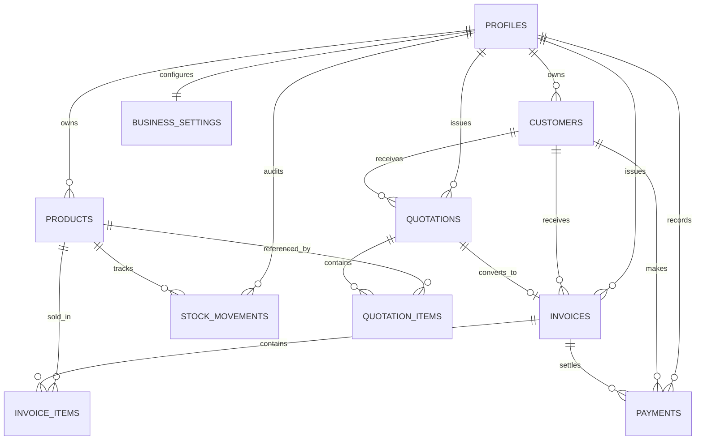

# StockIN — Database Architecture & Schema Specification

This document details the PostgreSQL database schema for StockIN, hosted on Supabase. Supabase PostgreSQL serves as the **single source of truth** for all business data.

---

## 1. Entity-Relationship Overview



---

## 2. Table Specifications

### 1. `public.profiles`
Links directly to Supabase Auth `auth.users`.
- `id` (UUID, Primary Key, References `auth.users(id)` ON DELETE CASCADE)
- `email` (TEXT, NOT NULL)
- `full_name` (TEXT)
- `business_name` (TEXT)
- `phone` (TEXT)
- `created_at` (TIMESTAMPTZ, DEFAULT NOW())
- `updated_at` (TIMESTAMPTZ, DEFAULT NOW())

### 2. `public.products`
Catalog items, stock balances, and pricing.
- `id` (UUID, Primary Key, DEFAULT gen_random_uuid())
- `user_id` (UUID, References `auth.users(id)` ON DELETE CASCADE)
- `name` (TEXT, NOT NULL)
- `sku` (TEXT)
- `category` (TEXT, DEFAULT 'General')
- `brand` (TEXT)
- `unit` (TEXT, DEFAULT 'pcs')
- `purchase_price` (NUMERIC(12,2), DEFAULT 0)
- `selling_price` (NUMERIC(12,2), DEFAULT 0)
- `stock` (INTEGER, DEFAULT 0)
- `min_stock` (INTEGER, DEFAULT 5)
- `tax_rate` (NUMERIC(5,2), DEFAULT 18.00)
- `hsn_code` (TEXT)
- `description` (TEXT)
- `status` (TEXT, CHECK status IN ('in_stock', 'low_stock', 'out_of_stock', 'archived'))
- `created_at` (TIMESTAMPTZ, DEFAULT NOW())
- `updated_at` (TIMESTAMPTZ, DEFAULT NOW())

### 3. `public.stock_movements`
Immutable audit ledger for every inventory change.
- `id` (UUID, Primary Key, DEFAULT gen_random_uuid())
- `user_id` (UUID, References `auth.users(id)` ON DELETE CASCADE)
- `product_id` (UUID, References `products(id)` ON DELETE CASCADE)
- `type` (TEXT, CHECK type IN ('STOCK_IN', 'STOCK_OUT', 'ADJUSTMENT'))
- `quantity` (INTEGER, NOT NULL)
- `previous_stock` (INTEGER, NOT NULL)
- `new_stock` (INTEGER, NOT NULL)
- `reason` (TEXT)
- `reference_id` (TEXT) — e.g. Invoice ID or PO number
- `created_at` (TIMESTAMPTZ, DEFAULT NOW())

### 4. `public.customers`
CRM records, contact details, and running balances.
- `id` (UUID, Primary Key, DEFAULT gen_random_uuid())
- `user_id` (UUID, References `auth.users(id)` ON DELETE CASCADE)
- `name` (TEXT, NOT NULL)
- `company_name` (TEXT)
- `phone` (TEXT)
- `email` (TEXT)
- `address` (TEXT)
- `city` (TEXT)
- `state` (TEXT)
- `gstin` (TEXT)
- `total_orders` (INTEGER, DEFAULT 0)
- `total_spent` (NUMERIC(12,2), DEFAULT 0)
- `outstanding` (NUMERIC(12,2), DEFAULT 0)
- `status` (TEXT, CHECK status IN ('active', 'inactive'))
- `created_at` (TIMESTAMPTZ, DEFAULT NOW())
- `updated_at` (TIMESTAMPTZ, DEFAULT NOW())

### 5. `public.quotations`
Sales estimates and proforma proposals. **Never deducts inventory.**
- `id` (UUID, Primary Key, DEFAULT gen_random_uuid())
- `user_id` (UUID, References `auth.users(id)` ON DELETE CASCADE)
- `quotation_number` (TEXT, NOT NULL)
- `customer_id` (UUID, References `customers(id)` ON DELETE SET NULL)
- `customer_name` (TEXT, NOT NULL)
- `date` (DATE, NOT NULL)
- `valid_until` (DATE, NOT NULL)
- `subtotal` (NUMERIC(12,2), DEFAULT 0)
- `tax_total` (NUMERIC(12,2), DEFAULT 0)
- `discount` (NUMERIC(12,2), DEFAULT 0)
- `grand_total` (NUMERIC(12,2), DEFAULT 0)
- `notes` (TEXT)
- `status` (TEXT, CHECK status IN ('draft', 'sent', 'accepted', 'rejected', 'expired', 'converted'))
- `converted_invoice_id` (UUID, References `invoices(id)` ON DELETE SET NULL)
- `storage_file_path` (TEXT)
- `file_size` (BIGINT, DEFAULT 0)
- `pdf_status` (TEXT, DEFAULT 'pending' CHECK status IN ('pending', 'ready', 'failed'))
- `pdf_uploaded_at` (TIMESTAMPTZ)
- `pdf_error` (TEXT)
- `created_at` (TIMESTAMPTZ, DEFAULT NOW())
- `updated_at` (TIMESTAMPTZ, DEFAULT NOW())

### 6. `public.quotation_items`
- `id` (UUID, Primary Key, DEFAULT gen_random_uuid())
- `quotation_id` (UUID, References `quotations(id)` ON DELETE CASCADE)
- `product_id` (UUID, References `products(id)` ON DELETE SET NULL)
- `product_name` (TEXT, NOT NULL)
- `quantity` (INTEGER, NOT NULL)
- `unit_price` (NUMERIC(12,2), NOT NULL)
- `tax_rate` (NUMERIC(5,2), DEFAULT 18.00)
- `tax_amount` (NUMERIC(12,2), DEFAULT 0)
- `total` (NUMERIC(12,2), NOT NULL)

### 7. `public.invoices`
Tax invoices. **Deducts inventory and logs `STOCK_OUT` movements.**
- `id` (UUID, Primary Key, DEFAULT gen_random_uuid())
- `user_id` (UUID, References `auth.users(id)` ON DELETE CASCADE)
- `invoice_number` (TEXT, NOT NULL)
- `customer_id` (UUID, References `customers(id)` ON DELETE SET NULL)
- `customer_name` (TEXT, NOT NULL)
- `date` (DATE, NOT NULL)
- `due_date` (DATE, NOT NULL)
- `subtotal` (NUMERIC(12,2), DEFAULT 0)
- `tax_total` (NUMERIC(12,2), DEFAULT 0)
- `discount` (NUMERIC(12,2), DEFAULT 0)
- `grand_total` (NUMERIC(12,2), DEFAULT 0)
- `paid_amount` (NUMERIC(12,2), DEFAULT 0)
- `balance` (NUMERIC(12,2), DEFAULT 0)
- `status` (TEXT, CHECK status IN ('draft', 'pending', 'paid', 'overdue', 'cancelled'))
- `quotation_id` (UUID, References `quotations(id)` ON DELETE SET NULL)
- `storage_file_path` (TEXT)
- `file_size` (BIGINT, DEFAULT 0)
- `pdf_status` (TEXT, DEFAULT 'pending' CHECK status IN ('pending', 'ready', 'failed'))
- `pdf_uploaded_at` (TIMESTAMPTZ)
- `pdf_error` (TEXT)
- `created_at` (TIMESTAMPTZ, DEFAULT NOW())
- `updated_at` (TIMESTAMPTZ, DEFAULT NOW())

### 8. `public.invoice_items`
- `id` (UUID, Primary Key, DEFAULT gen_random_uuid())
- `invoice_id` (UUID, References `invoices(id)` ON DELETE CASCADE)
- `product_id` (UUID, References `products(id)` ON DELETE SET NULL)
- `product_name` (TEXT, NOT NULL)
- `quantity` (INTEGER, NOT NULL)
- `unit_price` (NUMERIC(12,2), NOT NULL)
- `tax_rate` (NUMERIC(5,2), DEFAULT 18.00)
- `tax_amount` (NUMERIC(12,2), DEFAULT 0)
- `total` (NUMERIC(12,2), NOT NULL)

### 9. `public.payments`
- `id` (UUID, Primary Key, DEFAULT gen_random_uuid())
- `user_id` (UUID, References `auth.users(id)` ON DELETE CASCADE)
- `invoice_id` (UUID, References `invoices(id)` ON DELETE CASCADE)
- `customer_id` (UUID, References `customers(id)` ON DELETE SET NULL)
- `amount` (NUMERIC(12,2), NOT NULL)
- `payment_date` (DATE, NOT NULL)
- `payment_method` (TEXT, CHECK payment_method IN ('cash', 'bank_transfer', 'upi', 'cheque', 'card', 'other'))
- `reference_number` (TEXT)
- `notes` (TEXT)
- `created_at` (TIMESTAMPTZ, DEFAULT NOW())

### 10. `public.business_settings`
- `user_id` (UUID, Primary Key, References `auth.users(id)` ON DELETE CASCADE)
- `company_name` (TEXT, NOT NULL)
- `address` (TEXT)
- `phone` (TEXT)
- `email` (TEXT)
- `gstin` (TEXT)
- `pan` (TEXT)
- `bank_name` (TEXT)
- `account_number` (TEXT)
- `ifsc_code` (TEXT)
- `branch_name` (TEXT)
- `invoice_prefix` (TEXT, DEFAULT 'INV')
- `quotation_prefix` (TEXT, DEFAULT 'QUO')
- `terms_and_conditions` (TEXT)
- `footer_message` (TEXT)
- `updated_at` (TIMESTAMPTZ, DEFAULT NOW())

### 11. `public.documents`
Document metadata and audit trail for Invoices and Quotations (Step 5).
- `id` (TEXT, Primary Key)
- `user_id` (UUID, References `auth.users(id)` ON DELETE CASCADE)
- `document_type` (TEXT, CHECK IN ('invoice', 'quotation'))
- `document_id` (TEXT, NOT NULL)
- `document_number` (TEXT, NOT NULL)
- `customer_id` (TEXT, NOT NULL)
- `customer_name` (TEXT, NOT NULL)
- `file_path` (TEXT, NOT NULL)
- `file_size` (BIGINT, DEFAULT 0 NOT NULL)
- `mime_type` (TEXT, DEFAULT 'application/pdf' NOT NULL)
- `pdf_status` (TEXT, DEFAULT 'ready' CHECK IN ('pending', 'ready', 'failed'))
- `created_at` (TIMESTAMPTZ, DEFAULT NOW())
- `updated_at` (TIMESTAMPTZ, DEFAULT NOW())
- **Constraint**: `UNIQUE(user_id, document_type, document_id)`
- **Indexes**: `(user_id)`, `(user_id, created_at DESC)`, `(user_id, document_type)`, `(user_id, customer_id)`, `(user_id, document_number)`

---

## 2.1 Supabase Storage (`documents` Bucket)
Dedicated private bucket for PDF files.
- `id`: `'documents'`
- `public`: `false` (Strictly private; accessed only via authenticated signed URLs)
- `file_size_limit`: `10485760` (10 MB)
- `allowed_mime_types`: `['application/pdf']`
- **Path Isolation Convention**:
  - Invoices: `{user_id}/invoices/{invoice_id}.pdf`
  - Quotations: `{user_id}/quotations/{quotation_id}.pdf`
- **Storage Policies**:
  - `(storage.foldername(name))[1] = auth.uid()::text` for SELECT, INSERT, UPDATE, DELETE.

---

## 3. Row Level Security (RLS) Policies

All tables enforce PostgreSQL RLS. The rule for every user-scoped table is:
```sql
ALTER TABLE public.<table_name> ENABLE ROW LEVEL SECURITY;

CREATE POLICY "<table_name>_owner_select" ON public.<table_name>
    FOR SELECT USING (auth.uid() = user_id);

CREATE POLICY "<table_name>_owner_insert" ON public.<table_name>
    FOR INSERT WITH CHECK (auth.uid() = user_id);

CREATE POLICY "<table_name>_owner_update" ON public.<table_name>
    FOR UPDATE USING (auth.uid() = user_id);

CREATE POLICY "<table_name>_owner_delete" ON public.<table_name>
    FOR DELETE USING (auth.uid() = user_id);
```

For child item tables (`quotation_items`, `invoice_items`), RLS joins through the parent table:
```sql
CREATE POLICY "invoice_items_owner_all" ON public.invoice_items
    FOR ALL USING (
        EXISTS (
            SELECT 1 FROM public.invoices i
            WHERE i.id = invoice_items.invoice_id
            AND i.user_id = auth.uid()
        )
    );
```

---

## 4. Stored Procedures & Transactions (RPC)

### `convert_quotation_to_invoice_rpc(p_quotation_id UUID, p_due_date DATE, p_user_id UUID)`
Executed as a single ACID transaction:
1. Validates quotation ownership (`auth.uid() = p_user_id`).
2. Checks quotation status (fails if already `converted`).
3. Verifies stock availability for each quotation item.
4. Generates a new invoice number using the user's invoice prefix.
5. Inserts record into `public.invoices`.
6. Inserts line items into `public.invoice_items`.
7. Decrements stock in `public.products`.
8. Records `STOCK_OUT` audit rows in `public.stock_movements`.
9. Updates quotation status to `converted` and records `converted_invoice_id`.
10. If any step fails, the entire transaction is rolled back.
